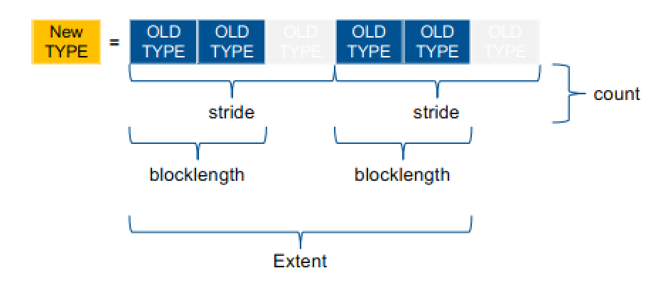
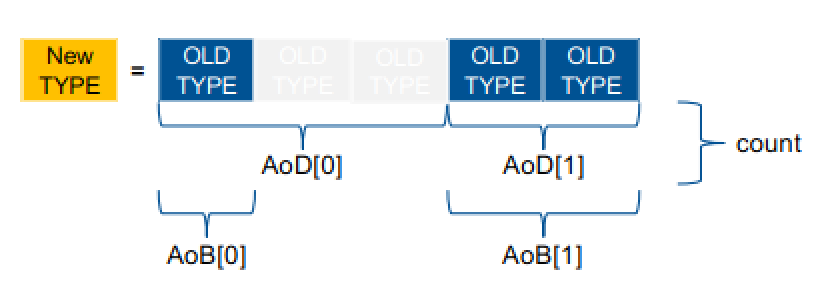
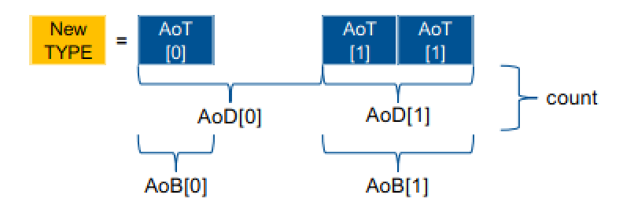

# Parallel Programming Chapter 10: MPI more advances

## 1. MPI customized data type

use built in MPI data types to build derived data types

### 1.1. Datatype magagement

the created data types can not be directly used. They need to be commit first.

```c++
int MPI_Type_commit(MPI_Datatype *datatype)
```

after using the data types, we can also free them.

```c++
int MPI_Type_free(MPI_Datatype *datatype)
```

### 1.2. Derived MPI Datatypes

#### 1.2.1. Contiguously connect existing datatype

```c++
int MPI_Type_contiguous(int count, MPI_Datatype oldtype, MPI_Datatype *newtype)
```

contiguously connects `count` number of oldtype to form a new type.


#### 1.2.2. Constrct a vector datatype

```c++
int MPI_Type_vector(int count, int blocklength, int stride, MPI_Datatype oldtype, MPI_Datatype *newtype);
```

* count: the number of blocks
* blocklength: the number of elements in each block
* stride: the number of elements space in each block(the space is not necessarily all used)



#### 1.2.3. Construct an indexed datatype

```c++
int MPI_Type_indexed(int count, const int array_of_blocklengths[],
const int array_of_displacements[],
MPI_Datatype oldtype, MPI_Datatype *newtype);
```

* count: the number of blocks
* array_of_blocklengths[]: the array of the numbers of elemnts in each block(may vary now)
* array_of_displacements[]: the array of the number of element space for each block



#### 1.2.4. Creating a strucct datatype

```c++
int MPI_Type_create_struct(int count, const int array_of_blocklengths[], const MPI_Aint array_of_displacements[], const MPI_Datatype array_of_types[], MPI_Datatype *newtype)
```

the unit for array_of_displacements is bytes rathter than the item



#### 1.2.5. Construct a subarray datatype

```c++
int MPI_Type_create_subarray(int ndims, const int array_of_sizes[],
const int array_of_subsizes[], const int array_of_starts[],
int order, MPI_Datatype oldtype, MPI_Datatype *newtype)
```

### 1.3. Inspect datatype

```c++
int MPI_Type_get_envelope(MPI_Datatype datatype, int *num_integers, int *num_addresses, int *num_datatypes, int *combiner)
```

query metadata information on a type

* combiner: tpye of constructor used
* returns number of elements used in construction

```c++
int MPI_Type_get_contents(MPI_Datatype datatype, int max_integers, int max_addresses, int max_datatypes, int array_of_integers[],
MPI_Aint array_of_addresses[], MPI_Datatype array_of_datatypes[])
```

query actual type information

## 2. Memory, data movement and synchronization

### 2.1. Create public memory

any memory created by a process is, by default, only locally accessible.

but user can declare memory region as remotely accessible with MPI "Window".

A group of processes collectively create a "Window" tied to a communicator. Once a memory region is declared as remotely accessible, all processes in the window can read and write data to this memory

#### 2.1.1. Make and free local memory accessible

1. create window for existing local memory region

    only data exposed iin a window can be accessed by other processes

    ```c++
    int MPI_Win_create(void *base, MPI_Aint size, int disp_unit, MPI_Info info, MPI_Comm comm, MPI_Win *win)
    ```

    * base: pointer to local data to expose
    * size: size of local data in bytes
    * disp_unit: local unit size for displacements, in bytes (positive integer)
    * info: info argument (handle)
    * comm: communicator (handle)
    * win: newly created window (handle)

2. free window

    every time we create a window, we must free it in the end

    ```c++
    int MPI_Win_free(MPI_Win *win)
    ```

3. allocate memory and create a window for it for global usage

    ```c++
    int MPI_Win_allocate(MPI_Aint size, int disp_unit, MPI_Info info, MPI_Comm comm, void *base, MPI_Win *win)
    ```

4. create a window, to which data can later be attached

    ```c++
    int MPI_Win_create_dynamic(MPI_Info info, MPI_Comm comm, MPI_Win *win)
    ```

    1. attaching memory to dynamic window

        ```c++
        int MPI_Win_attach(MPI_Win win, void *base, MPI_Aint size)
        ```

        * win: window to attach memory to
        * base: pointer to base of memory
        * size: size if memory region
        * local operation
        * user has to ensure memory is attached before accessing it

    2. detaching memory from dynamic window

        ```c++
        int MPI_Win_detech(MPI_Win win, void *base)
        ```

        * win: window to attach memory to
        * base: pointer to base of memory region

    example:

    ```c++
    int main(int argc, char **argv){
        int *a;
        MPI_Win win;
        MPI_Init(&argc, &argv);
        MPI_Win_create_dynamic(MPI_INFO_NULL, MPI_COMM_WORLD, &win);

        a = (void *) malloc(1000 * sizeof(int));
        a[0] = 1; a[1] = 2;

        MPI_Win_attach(win, a, 1000*sizeof(int));

        MPI_Win_detach(win, a);
        MPI_Win_free(&win);

        MPI_Finalize();
        return 0;
    }
    ```

### 2.2. Data movement

#### 2.2.1. Basics operations

1. get

    similar to a receive operation, but data description triples for origin and target

    ```c++
    int MPI_Get(void *origin_addr, int origin_count, MPI_Datatype origin_datatype, int target_rank, MPI_Aint target_disp, int target_count, MPI_Datatype target_datatype, MPMI_Win win)
    ```

2. put

    similar to a send operation, but data description for origin and target

    ```c++
    int MPI_Put(void *origin_addr, int origin_count, MPI_Datatype origin_datatype, int target_rank, MPI_Aint target_disp, int target_count, MPI_Datatype target_datatype, MPI_Win win)
    ```

3. accumulate

    ```c++
    int MPI_Accumulate(void *origin_addr, int origin_count, MPI_Datatype origin_datatype, int target_rank, MPI_Aint target_disp, int target_count, MPI_Datatype target_datatype, MPI_Op op, MPI_Win win)
    ```

### 2.3. RMA synchronization

#### 2.3.1. Synchronization models

1. Fence (active target)

   `MPI_Win_fence(assert, win)`

2. Post-start-complete-wait

    1. exposure epoch

        opened with: `MPI_Win_post`
        closed by: `MPI_Win_wait`

    2. access epoch

        opened by: `MPI_Win_start`
        closed by: `MPI_Win_complete`

3. Lock/Unlock (passive target)

    one-sided, asynchronous communication

### 2.4. Shared memory in MPI

#### 2.4.1. how to use

```c++
int MPI_Win_allocate_shared (MPI_Aint size, int disp_unit, MPI_Info info, MPI_Comm comm, void *baseptr, MPI_Win *win)
```

## 3. MPI + X (OpenMP, ...)

### 3.1. Thread safety

#### 3.1.1. Four levels of thread safety

1. `MPI_THREAD_SINGLE`
    * only one thread exists in the application
2. `MPI_THREAD_FUNNELED`
    * multithreaded, but only the main thread makes MPI calls
3. `MPI_THREAD_SERIALIZED`
    * multithreaded, but only one thread at a time makes MPI calls
4. `MPI_THREAD_MULTIPLE`
    * muultithreaded, and any thread can make MPI calls at any time
    * user needs to make sure racing calls are avoided

#### 3.1.2. Thread safe probing

1. `MPI_Probe`/`MPI_Iprobs` inspects unexpected message queue
    * if message is found, this is indicated to application
    * application can then start the receive

    ```c++
    // thread 1
    MPI_Probe(); // from 0
    MPI_Recv(); // from 0
    ```

    ```c++
    // thread 2
    MPI_Probe(); // from 0
    MPI_Recv(); // from 0
    ```

    * problem in multithreaded programs: two threads call MPI_Probe and both return
    * subsequent receive may get the wrong message
    * solution: see 2.

2. matching probes and receive

    1. matching probes

        `int MPI_Mprobe(int source, int tag, MPI_Comm comm, MPI_Message *message, MPI_Status *status)`

        `int MPI_Improbe(int source, int tag, MPI_Comm comm, int *flag, MPI_Message *message, MPI_Status *status)`

    2. matching receive

        `int MPI_Mrecv(void *buf, int count, MPI_Datatype datatype, MPI_Message *message, MPI_Status *status)`

        `int MPI_Imrecv(void* buf, int count, MPI_Datatype datatype, MPI_Message *message, MPI_Request *request)`

### 3.2. Hybrid programming MPI + OpenMP

1. `MPI_THREAD_SINGLE`
    * only one thread exists in the application
    * no OpenMP
2. `MPI_THREAD_FUNNELED`
    * multithreaded, but only the main thread makes MPI calls
    * MPI calls should be outside parallel regions and in master region
3. `MPI_THREAD_SERIALIZED`
    * multithreaded, but only one thread at a time makes MPI calls
    * MPI calls should be in critical or single regions
    * through added synchronization
4. `MPI_THREAD_MULTIPLE`
    * muultithreaded, and any thread can make MPI calls at any time
    * user needs to make sure racing calls are avoided
    * compatible with OpenMP tasking
